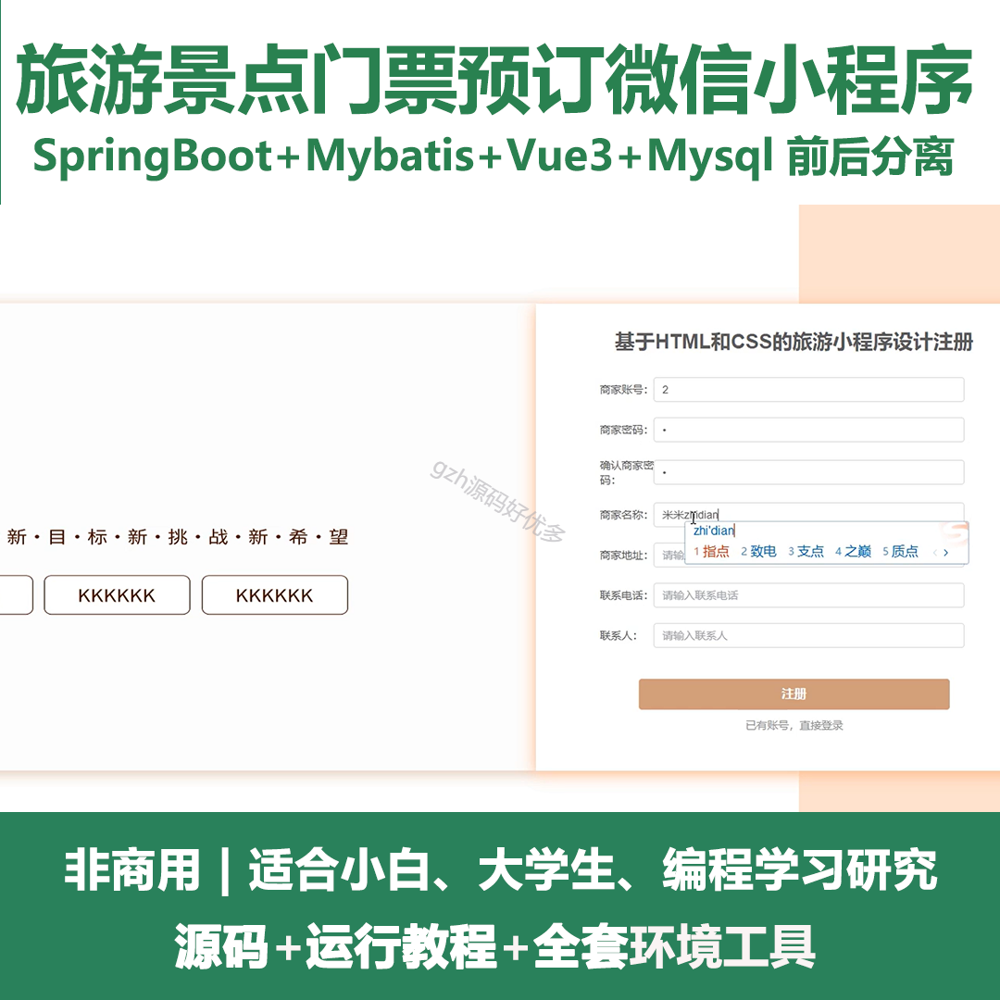
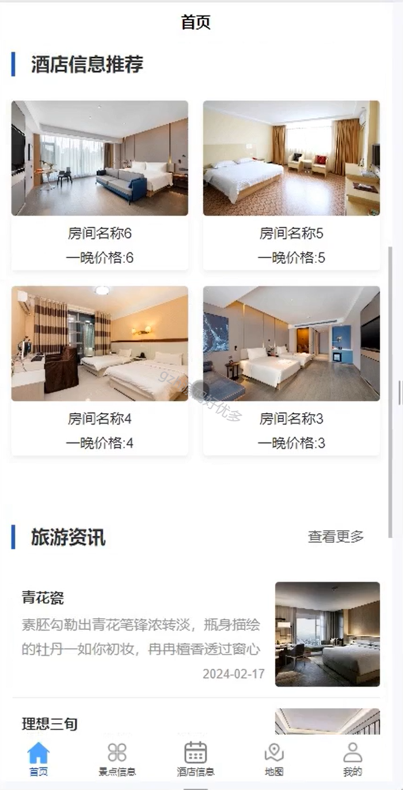
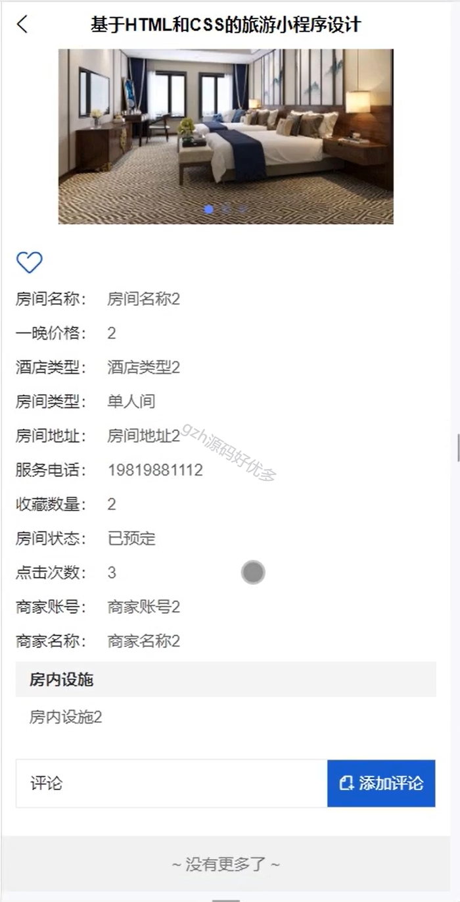
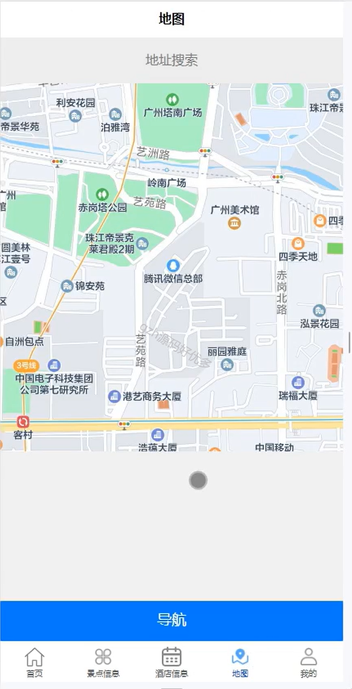
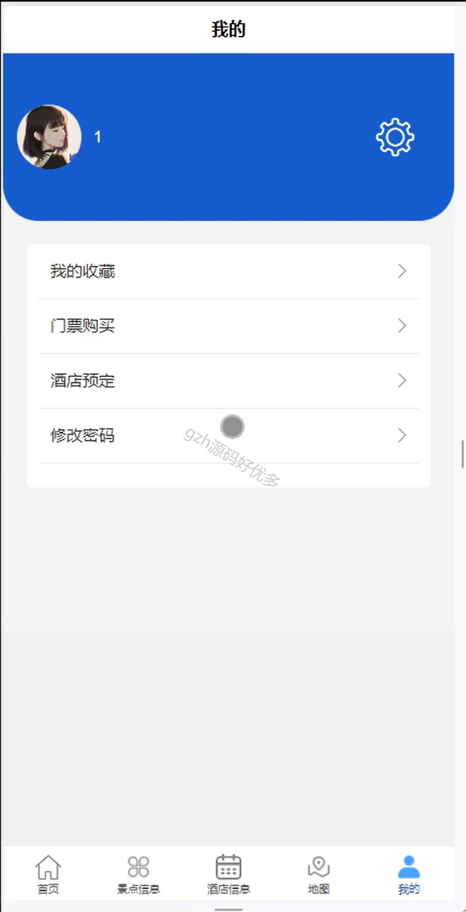
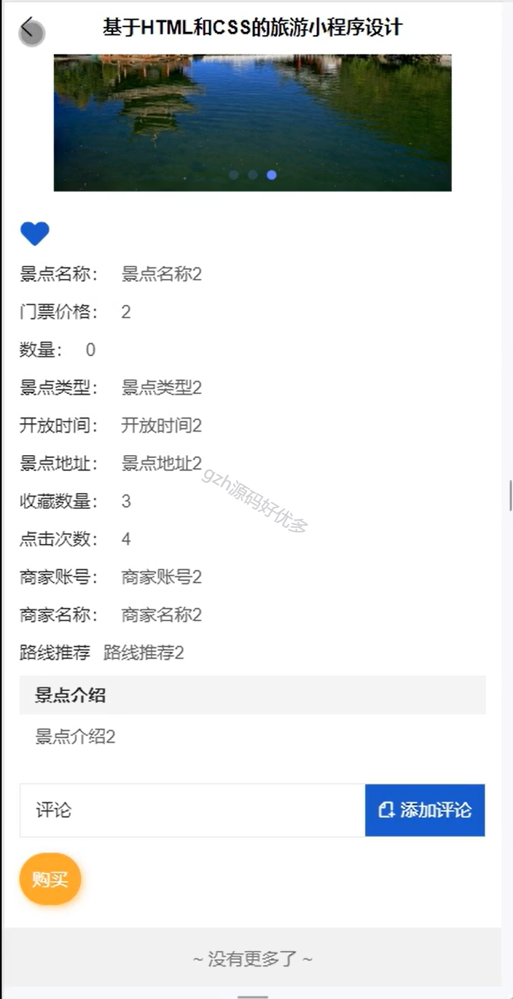
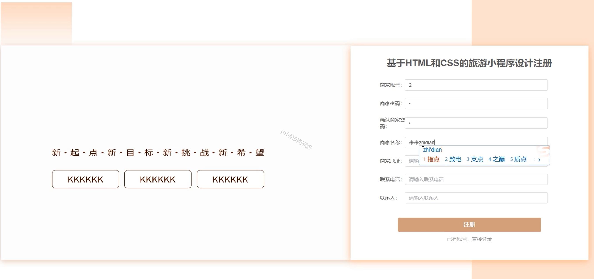
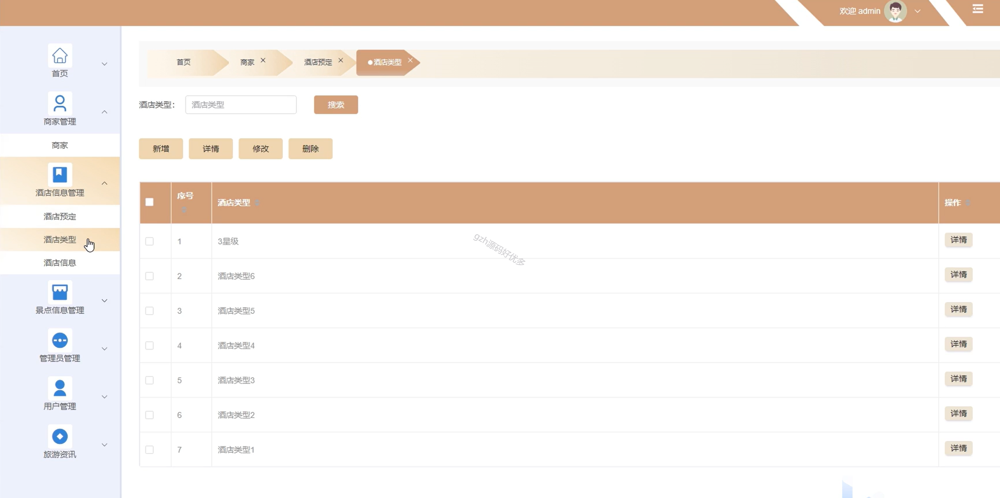
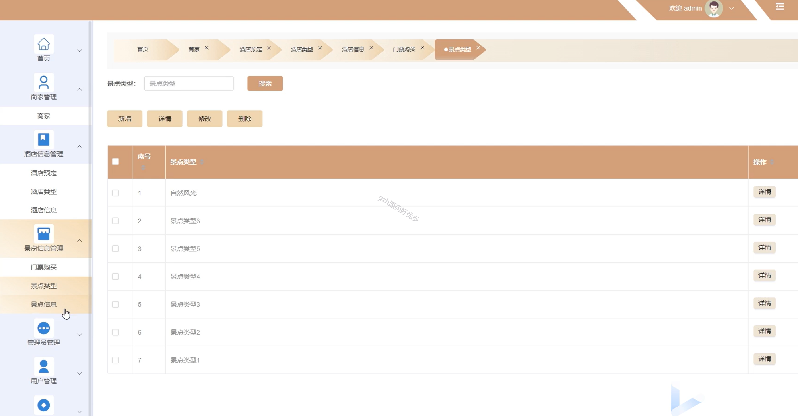

# mpweixinA073
mpweixinA073旅游景点门票预订微信小程序（Vue3+原生+unipp）
 
## 查看主页获取源码

### 一、作品包含

源码+数据库++全套环境和工具资源+部署教程

### 二、项目技术

前端技术：Html、Css、Js、Vue3.0、Element-ui、Uniapp

数据库：MySQL

后端技术：Java、Spring Boot、MyBatis

  

### 三、运行环境

开发工具：IDEA/eclipse + HBuilderX + 微信开发者工具

数据库：MySQL5.7（最低要5.7版本）

数据库管理工具：Navicat10以上版本

环境配置软件： JDK1.8+Maven3.6.3

前端Nodejs：16

### 四、项目介绍
项目编号：mpweixinA073

旅游景点门票预订微信小程序作用显著，主要体现在为游客提供便利、为景区提升管理效率和促进旅游市场发展等方面

主要功能有，景点管理，酒店管理，门票购买，酒店预定，商家管理，用户管理，旅游资讯等等

### 五、运行截图

  
